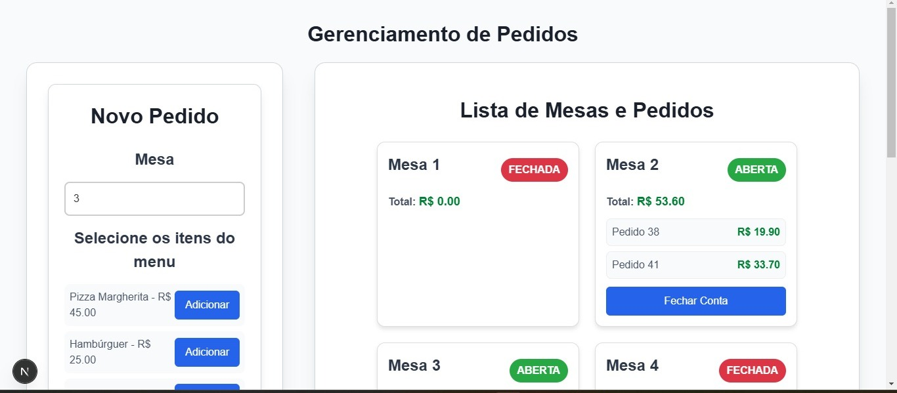
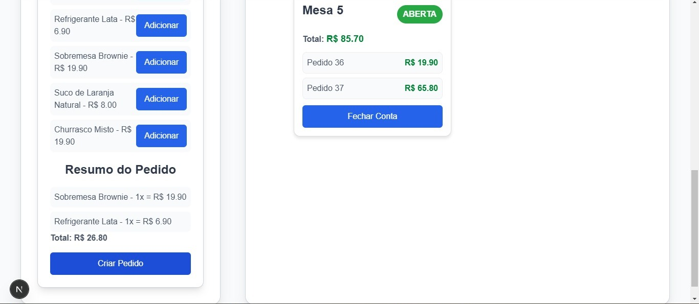

# Gerenciamento de Pedidos de Restaurante

## Sobre o Projeto
Este é um sistema para gerenciar pedidos em um restaurante, permitindo criar pedidos, associá-los a mesas, listar mesas e seus pedidos e fechar contas.
O projeto está completamente dockerizado, dispensando a necessidade de configurar dependências manualmente.

## Tecnologias Utilizadas

### Backend:
- **FastAPI** (Framework para a API)
- **MariaDB** (Banco de dados relacional)
- **SQLAlchemy** (ORM para manipulação do banco)
- **Alembic** (Migrations para o banco de dados)

### Frontend:
- **React + Next.js** (Framework para a interface do usuário)
- **Estilização:** Styled Components + PrimeReact
- **Axios** (Requisições HTTP para o backend)

### Docker:
- Containerização completa, com um Dockerfile e docker-compose.yml

## Como Rodar o Projeto

### 1️ Clonar o repositório
```bash
git clone https://github.com/seu-usuario/gerenciamento-pedidos.git
cd gerenciamento-pedidos
```
---

### 2 Rodar o projeto com Docker
Certifique-se de ter o **Docker** e **Docker Compose** instalados.

Para iniciar todos os containers:
```bash
docker-compose up --build
```
Isso irá subir os serviços:
- **Banco de dados (MariaDB)**
- **Backend (FastAPI)**
- **Frontend (React + Next.js)**

Aguarde até que todos os containers estejam rodando corretamente.

---

### 3️ Acessar a Aplicação

- **API FastAPI:** [http://localhost:8000/docs](http://localhost:8000/docs)
- **Interface do usuário (Frontend):** [http://localhost:3000](http://localhost:3000)

---

### 4 Caso de erro no preenchimento do banco

Caso o a API esteja vazia, significa que houve erro no script que automatiza o processo.
Então execute os seguintes comandos manualmente:
```bash
docker exec -it restaurante_backend alembic upgrade head 
```

```bash
docker exec -it restaurante_backend python -m app.populate_db
```

---

Imagens da Interface:



## Funcionalidades Implementadas
- **Criar pedidos e vincular a mesas**
- **Listar pedidos e mesas**
- **Fechar contas e remover pedidos de mesas fechadas**
- **Interface Intuitiva**
- **Backend estruturado com FastAPI e banco de dados MariaDB**

## Funcionalidade Pendente

- **Resumo de vendas diárias**: O endpoint `/orders/summary` ainda não está configurado para fazer o resumo de vendas do dia.

## Considerações Finais
Este projeto oferece um sistema funcional de gerenciamento de pedidos para restaurantes. Melhorias futuras podem incluir a adição do resumo de vendas diárias e a melhoria do designi da Interface.

**Autor:** Mateus de Jesus Santos 
**Data:** Março de 2025
